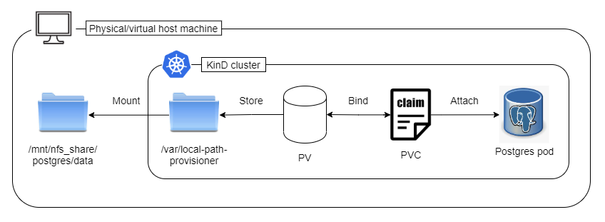
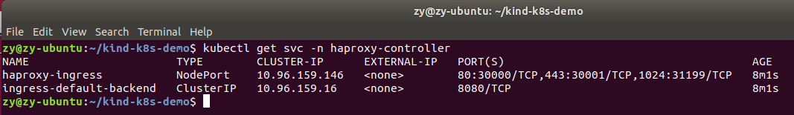
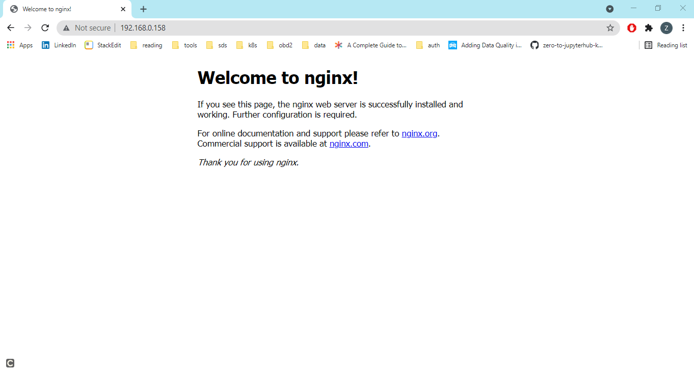
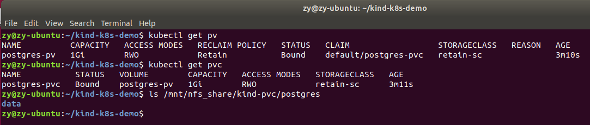
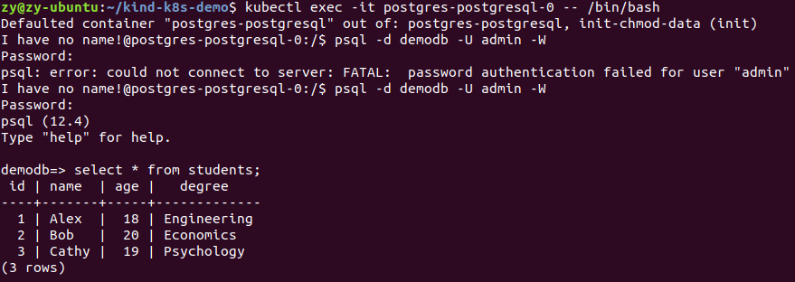

# Kubernetes in Docker (KinD) Demo

## Intro
This is a short demo on some hacky workarounds on two particular [problems](#motivation) that I have faced when I used [KinD](https://kind.sigs.k8s.io/docs/user/quick-start/) for local k8s development. If you are too lazy to read and prefer to see it in action, please skip to installation [steps](#installation-steps). 
> **__NOTE:__** This demo assumes that you have some basic knowledge about Kubernetes and how KinD differs from Kubernetes. This demo is also meant for Linux-based environment. I am sorry that you will need to do extra work to figure things out if you are using KinD in Windows.

## Motivation
KinD is an amazing tool for local Kubernetes development, but there are a few things that could pose as a hindrance when you are working with it. For example, 
1. One is how to expose a service in a way such that other non-local machines can also access that service. 
2. Another is how to persist data even if the KinD cluster is destroyed (since KinD cluster is meant for local development and short-lived).

## Exposing a Service to Non-local Machines
From the KinD loadbalancer [documentation](https://kind.sigs.k8s.io/docs/user/loadbalancer/), we know that we can expose a service by creating a layer 2 load balancer within the kind Docker network subnet. You can then expose a service with a `LoadBalancer` type, and MetalLB will assign an IP to it. You can then access the exposed service through the LoadBalancer's IP address locally. 

But what if you want to access the service from another machine? That machine doesn't understand the LoadBalancer's IP address that is in the kind Docker subnet so you won't be able to access that service. 

One workaround is that you can specify the service type as `NodePort` and assign port number range 30000-32767 (k8s NodePort range). 

Say you have created an `IngressController` with service type `NodePort` and port number 30000 for `http` service. This will then be the kind cluster's container port. You will then have to use KinD's `extraPortMappings` to map this container port to one of the host's port **during the cluster creation**. For example, 

```
cat <<EOF | kind create cluster --config=-
kind: Cluster
apiVersion: kind.x-k8s.io/v1alpha4
nodes:
- role: control-plane
  extraPortMappings:
  - containerPort: 30000
    hostPort: 80
    protocol: TCP
EOF
```

You will then be able to access the services exposed by the `IngressController` via `http://<IP_address_of_kind_cluster_machine>` from any device/machine within the same subnet.

## Persist Data Even if KinD is Destroyed
I personally used KinD for quite a lot of local k8s development on a local Linux VM. I have had some days when I boot up my VM, the KinD cluster just hangs and I can't figure out what's wrong. I would then have to destroy the cluster and spin up a new one, but all the data would be gone, which might be undesirable sometimes. 

I referenced from this [post](https://mauilion.dev/posts/kind-pvc/) for the hacky workaround. It takes some time to understand and set up, but it can save you a lot of time to recreate the data that you lose everytime you recreate the cluster. 

KinD uses Rancher's [local-path-provisioner](https://github.com/rancher/local-path-provisioner) as the default storage class out-of-the-box, and it mounts to the cluster's `/var/local-path-provisioner` directory. We will leverage this information and provision a local NFS service, then create `extraMounts` that maps the NFS's mount path during the cluster creation. 

```
cat <<EOF | kind create cluster --config=-
kind: Cluster
apiVersion: kind.x-k8s.io/v1alpha4
nodes:
- role: control-plane
  extraMounts:
  - hostPath: /mnt/nfs_share/kind-pvc
    containerPath: /var/local-path-provisioner
- role: worker
  extraMounts:
  - hostPath: /mnt/nfs_share/kind-pvc
    containerPath: /var/local-path-provisioner
```

We will also have to install NFS service on the VM. 

```
sudo apt update && sudo apt install nfs-kernel-server jq -y
sudo mkdir -p /mnt/nfs_share/kind-pvc
sudo chown -R nobody:nogroup /mnt/nfs_share/
sudo chmod -R 777 /mnt/nfs_share/
IPs=$(kubectl get nodes -o json | jq '.items[].status.addresses[] | select(.type=="InternalIP") | .address')
IP_ARRAY=($IPs)
INTERNAL_IP=`echo ${IP_ARRAY[0]} | tr -d '"'`
SUBNET="${INTERNAL_IP%.*}"
sudo sed -i '/^\/mnt\/nfs_share/d' /etc/exports
echo "Adding NFS configuration to allow Docker containers to use NFS server"
echo "/mnt/nfs_share ${SUBNET}.0/24(rw,sync,no_subtree_check)" | sudo tee -a /etc/exports > /dev/null
sudo exportfs -a
sudo systemctl restart nfs-kernel-server
```

We will also have to create a new storage class with Retain `reclaimPolicy` using the Rancher storage provisioner so that when the pod is destroyed, the `PersistentVolumeClaim` won't be deleted as well.

```
apiVersion: storage.k8s.io/v1
kind: StorageClass
metadata:
  name: retain-sc
provisioner: rancher.io/local-path
reclaimPolicy: Retain
volumeBindingMode: WaitForFirstConsumer
```

Here's the diagram that can hopefully clear up some confusion.
<p align="center">
  
</p>


## Installation Steps
This demo will use a ports 80 and 6443 so please make sure these ports are available. Before starting the installation, you need to change the IP address to your host's IP address in  `manifests/pv.yaml`. You can get your IP address by running `ifconfig`.

Run the commands below **from the project root directory** to perform the installation. Please wait for some time for the installation to complete. You can check the pods' statuses by running `kubectl get pod --all-namespaces`.
```
. scripts/install-binaries.sh
. scripts/create-cluster.sh
. scripts/install-nfs.sh
kubectl apply -f manifests/
helm repo add bitnami https://charts.bitnami.com/bitnami
helm repo update
helm install postgres bitnami/postgresql -f helm/postgres.yaml --set persistence.existingClaim=postgres-pvc
```
The manifest files will create a the following:
1. Nginx deployment and service
2. HAProxy ingress controller
3. Ingress rule that exposes the Nginx service
4. PostgreSQL deployment and service
5. StorageClass with Retain policy
6. PersistentVolume and PersistentVolumeClaim using the newly created StorageClass

### Verify that the Service works
After the installation is completed, you can do `kubectl get svc -n haproxy-controller` to verify that the service has type `NodePort`, and container port 80 is forwarded to node port 30000.
<p align="center">
  
</p>

you should be able to visit `http://<IP_address_of_kind_cluster_machine>` and you should land on the `Nginx` default page. You should be able to access the Nginx webpage using any other machines/devices that are connected to the same subnet as your KinD cluster (for example, your KinD cluster is running on your laptop, and you access the Nginx webpage using an iPad, but make sure both are connected to the **same** WiFi).
<p align="center">
  
</p>

### Verify that the Data is Persisted
To demonstrate that the data is persisted even if the KinD cluster is destroyed, we will use the newly created Postgres database. We can also verify that the `PersistentVolume`, `PersistentVolumeClaim` and `StorageClass` are correctly created. 
<p align="center">
  
</p>

We will use `kubectl exec -it` (interactive mode) and use `psql` to run queries on the Postgres database. 
```
kubectl exec -it postgres-postgresql-0 -- /bin/bash
PGPASSWORD=password psql -U admin -d demodb
create table students (id serial, name varchar(50), age smallint, degree varchar(50));
insert into students (name, age, degree) values ('Alex', 18, 'Engineering');
insert into students (name, age, degree) values ('Bob', 20, 'Economics');
insert into students (name, age, degree) values ('Cathy', 19, 'Psychology');
select * from students;
```
Your `students` table should look like the following.
<p align="center">
  
</p>

Exit the psql client and the tty session. Then recreate the cluster and query the database again to verify that the data is persisted.
```
exit
exit
kind delete clusters kind
. scripts/create-cluster.sh
kubectl apply -f manifests/
helm install postgres bitnami/postgresql -f manifests/postgres.yaml --set persistence.existingClaim=postgres-pvc
kubectl exec -it postgres-postgresql-0 -- /bin/bash
PGPASSWORD=password psql -U admin -d demodb
select * from students;
```

## Conclusion
By going through this demo, it helps to understand Kubernetes storage and networking at a slightly lower level (at least for me). I hope that this demo helped you to understand a little more about Kubernetes and KinD :)

## Cleanup 
```
kind delete clusters kind
sudo rm -rf /mnt/nfs-share
sudo apt uninstall -y nfs-kernel-server
```
Optional cleanups
```
sudo rm $(which kind)
sudo rm $(which helm)
sudo rm $(which kubectl)
```
